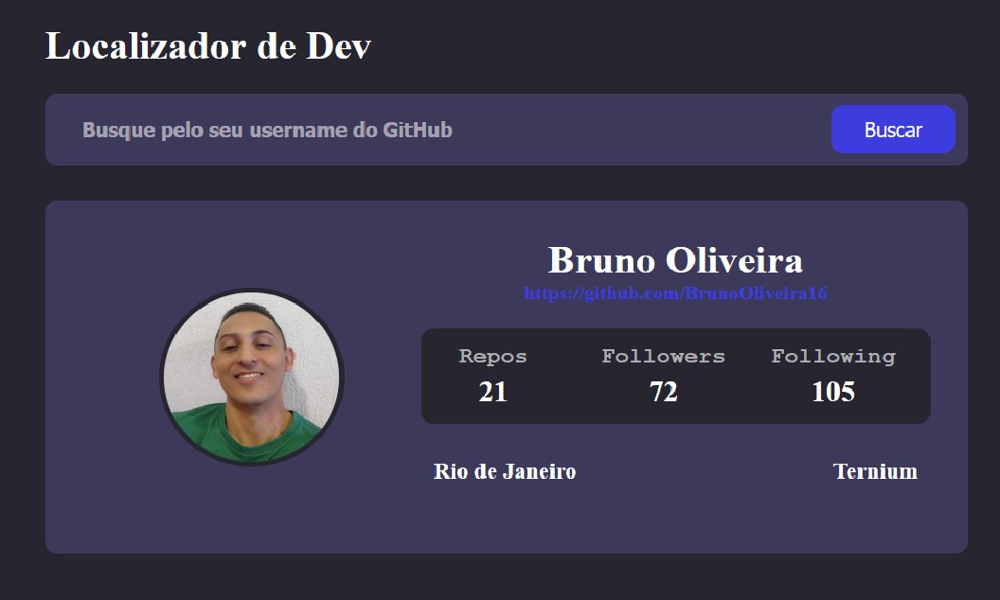

## 📚 CodeTogether Módulo 28 - Desenvolvedor Full Stack Python

**Tarefa:** Criar uma onepage que faça chamadas assincronas para uma API pública (ex:GitHub) e adicionar CSS na página para deixar uma aparência mais interessante para o usuário.

Endereço API GitHub: 
- [GitHub > Users](https://docs.github.com/en/rest/reference/users)

## 💻 Screenshot do projeto
- Tela 01

- Tela 02

